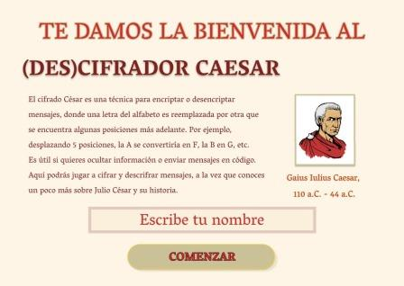

# Cifrado César

***

El Cifrado César fue creado por Julio César, importante personaje histórico romano, del siglo I a. C, quien fue fundamental en el desarrollo de los hechos que llevaron a la transición de la República al Imperio.

Como importante estratega militar, Julio César desarrolló este sistema de codificación por sustitución, utilizando 3 caracteres de desplazamiento. Es decir, la A se convertía en D, la C en E, y así sucesivamente.

Hoy en día, el Cifrado César tiene poca aplicación práctica, pues la tecnología permite decodificar los mensajes con facilidad. Empero, es una buena primera aproximación al desarrollo de una aplicación web, integrando la programación en HTML, CSS y Javascript.

## 1. UX Design

El objetivo del proyecto es diseñar una aplicación web que permita al usuario ingresar un texto y un número caracteres a ser desplazados (offset), para mostrar el mensaje descrifrado. A la vez, da la opción de ingresar un texto ya cifrado y un offset, para poder descifrarlo.

Esta aplicación web se concibe como una herramienta didáctica, dirigida a estudiantes de educación media y a cualquier persona con interés en Historia Antigua. Puede utilizarse como complemento a clases de historia sobre Roma, cuando se estudie la etapa de la transición de la República al Imperio, para destacar la importancia de la figura histórica de Julio César. También sirve como introducción al conocimiento de métodos criptográficos antiguos.

La imagen conceptual que inspiró el diseño del proyecto es esta foto del arco del templo de Venus Genetrix en el Foro de César, ubicado en el Foro Romano, que fue mandado a construir por Julio César entre el 54 y el 46 a. C. Los capiteles de la parte superior del arco dan una sensación de grandeza, mientras las tres columnas de orden corintio transmiten fortaleza.

Para completar la ambientación romana del proyecto, se utilizó este esquema de colores en tonos rojos, marrones y cremas, que las personas comúnmente asocian a la historia romana por el imaginario que tenemos construido gracias a películas y series.

Para acentuar la ambientación romana del proyecto, la tipografía utilizada mayormente es la del logotipo del hotel y casino Caesar's Palace, en Las Vegas.

Se incluye aquí el prototipo realizado en Figma, el cual tuvo varias modificaciones hasta llegar al resultado final:

Se realizaron iteraciones tanto del prototipo como de la aplicación web. Un usuario recomendó incluir un texto descriptivo en la primera pantalla, para entender de qué se trataba exactamente el proyecto y cuál era el modo de utilizar la interfaz.

